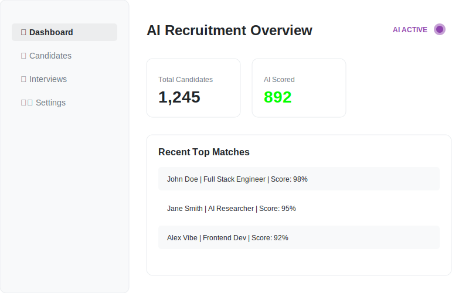
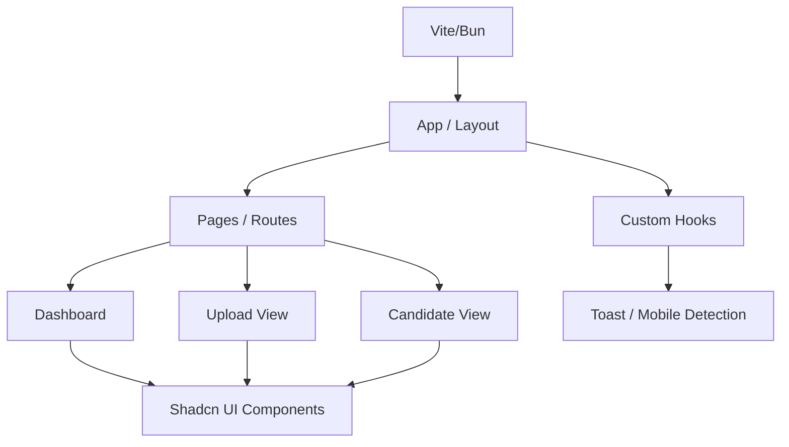

# 🤖 Sarah's AI Recruiter
**Intelligent Talent Acquisition Powered by AI**

[](https://github.com/google/gemini-cli)
[](https://reactjs.org/)
[](https://ui.shadcn.com/)

**Sarah's AI Recruiter** is a modern, AI-driven recruitment platform designed to streamline the hiring process. Built with React, TypeScript, and shadcn-ui, it provides a seamless interface for managing candidates, interviews, and feedback.

`✅ AI Talent Acquisition | ✅ React 18+ | ✅ MIT Licensed | ✅ Vite/Bun Optimized`

## 🎬 UI Preview


## 🏗 Architecture
The application is built with a modern React component-based architecture, utilizing atomic design principles and custom hooks for business logic.



### Core Components
- **Pages**: Top-level route components for Dashboard, Analysis, and Uploads.
- **Components**: Functional components including Sidebar, NavLinks, and specialized Modals.
- **UI Kit**: Reusable shadcn/ui primitives for consistent design.
- **Logic Layers**: Custom hooks for state management and interactive feedback.

## 🛠 Tech Stack
- **Framework**: React 18+ (TypeScript)
- **Styling**: Tailwind CSS & shadcn/ui
- **Build Tool**: Vite / Bun
- **Platform**: Lovable

## 🚀 Getting Started
```bash
npm install
npm run dev
```

## 📜 License
This project is licensed under the **MIT License** - see the [LICENSE](LICENSE) file for details.

---
*Built with ❤️ for Modern Recruitment.*
