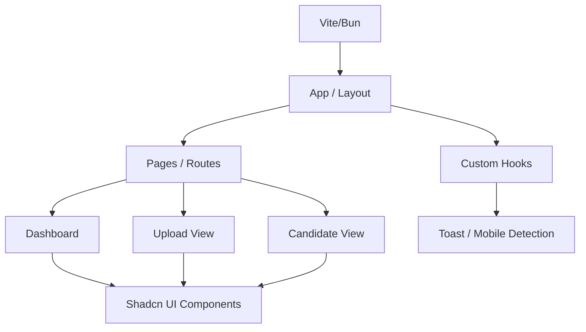

# 🤖 Sarah's AI Recruiter
**Intelligent Talent Acquisition Powered by AI**

**Sarah's AI Recruiter** is a modern, AI-driven recruitment platform designed to streamline the hiring process. Built with React, TypeScript, and shadcn-ui, it provides a seamless interface for managing candidates, interviews, and feedback.

`✅ AI Talent Acquisition | ✅ React 18+ | ✅ MIT Licensed | ✅ Vite/Bun Optimized`

## 🚀 Getting Started

## 🏗 Architecture
The application is built with a modern React component-based architecture, utilizing atomic design principles for UI components and custom hooks for business logic.

### Core Components
- **Pages (`src/pages/`)**: Top-level route components for Dashboard, Analysis, and Uploads.
- **Components (`src/components/`)**: Functional components including Sidebar, NavLinks, and specialized Modals.
- **UI Kit (`src/components/ui/`)**: Reusable shadcn/ui primitives for consistent design.
- **Logic Layers (`src/lib/` & `src/hooks/`)**: Utility functions and custom React hooks for state and interaction management.

## What technologies are used for this project?

This project is built with:

- Vite
- TypeScript
- React
- shadcn-ui
- Tailwind CSS

## How can I deploy this project?

Simply open [Lovable](https://lovable.dev/projects/REPLACE_WITH_PROJECT_ID) and click on Share -> Publish.

## 📜 License
This project is licensed under the **MIT License** - see the [LICENSE](LICENSE) file for details.

---
*Built with ❤️ for Modern Recruitment.*
